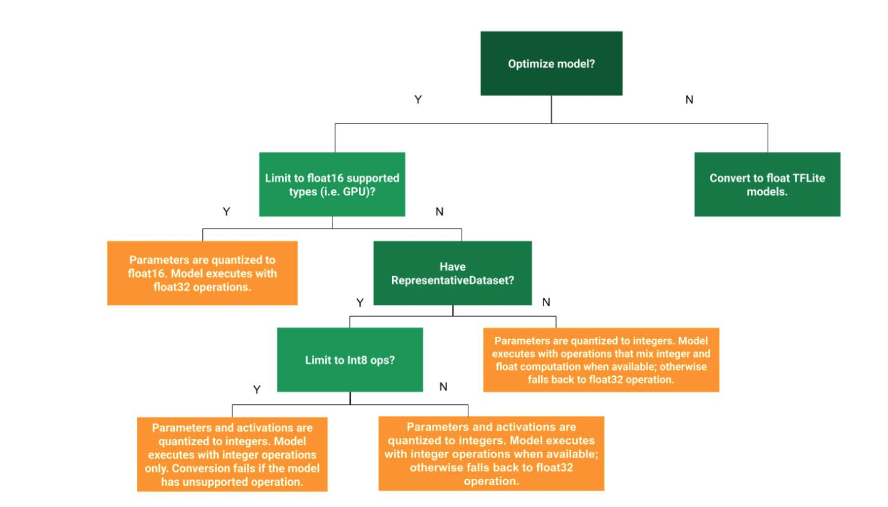

# Quantization

lower precision of model parameters 
most popular optimization technique. can take place in training (Quantization Aware Training) of after you trained your model (Post Training Quantization)

## Post Training Quantization (PTQ)
[Tflite doc](https://www.tensorflow.org/lite/performance/post_training_quantization)

| TF Lite Option | technique used | Benefits | Hardware | \
|:----------|-------------| \
|`OPTIMIZE_FOR_SIZE`|"Hybrid operations" | 4x smaller, 2-3x speedup, accuracy | CPU|\
| `DEFAULT` | Integer Quantization | 4x smaller, More speedup | CPU, Edge TPU, etc.|


TF Lite offers another optimization option called `OPTIMIZE_FOR_LATENCY`. this option optimizes your model for speed

```python

import tensorflow as tf
converter = tf.lite.TFLiteConverter.from_saved_model(saved_model_dir)
converter.optimizations = [tf.lite.Optimize.OPTIMIZE_FOR_SIZE]
tflite_quant_model = converter.convert()

```

Quantizise the weights and the activations 
```python
# Define the generator
def generator():
    data = tfds.load(...)
    for _ in range(num_calibration_steps):
        image = data.take(1)
        yield [image]

converter = tf.lite.TFLiteConverter.from_saved_model(saved_model_dir)

# set the optimization mode
converter.optimizations = [tf.lite.Optimize.DEFAULT]

# Pass the representative dataset to the converter
converter.representative_dataset = tf.lite.RepresentativeDataset(generator)

# Restricting supported target op specification to INT8
# Full-integer quantization
converter.target_spec.supported_ops = [tf.lite.OpsSet.TFLITE_BUILTINS_INT8]
```



# TFLite delegate

Delegate opteration to a specialized HW

one of nice feature of TF is that it allows us to test our TFLite model without need of deploying it.

```python

# Load TFLite model and allocate tensors
interpreter = tf.lite.Interpreter(model_content=tflite_model)
interpreter.allocate_tensors()

# Get input and output tensors
input_details = interpreter.get_input_details()
output_details = interpreter.get_output_details()

# Point the data to be used for testing and run the interpreter
interpreter.set_tensor(input_details[0]['index'], input_data)
interpreter.invoke()
tflite_results = interpreter.get_tensor(output_details[0]['index'])

```

# TFLite models

[link to collection of TFLite models](https://www.tensorflow.org/lite/models)

[notebook linear regression](https://colab.research.google.com/github/tensorflow/examples/blob/master/courses/udacity_intro_to_tensorflow_lite/tflite_c01_linear_regression.ipynb#scrollTo=FOAIMETeJmkc)
